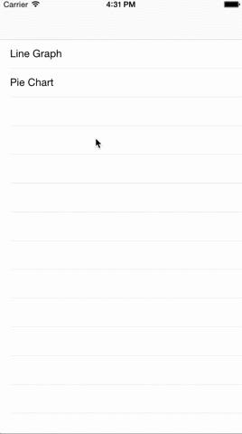

# ARGraphs
Fun graphs for iOS. 


All Charts respond to the Appearance selector so you can set App wide settings in App Did finish launching.

    [[ARLineGraph appearance] setLabelColor:[UIColor redColor]];
    [[ARLineGraph appearance] setTintColor:[UIColor blueColor]];
    [[ARLineGraph appearance] setLineColor:[UIColor redColor]];
    [[ARLineGraph appearance] setShowXLegend:YES];
    [[ARLineGraph appearance] setShowXLegendValues:NO];
    [[ARLineGraph appearance] setShowDots:NO];
    [[ARLineGraph appearance] setShowMeanLine:NO];
    [[ARLineGraph appearance] setUseBackgroundGradient:NO];
    [[ARLineGraph appearance] setShowMinMaxLines:NO];
    
    [[ARPieChart appearance] setUseBackgroundGradient:NO];
    [[ARPieChart appearance] setLabelColor:[UIColor redColor]];
    
## ARLineGraph

### Customizing


## ARPieChart
 ARPieChart represents an array of data in a pie format. The data array can either be an array of datapoints or an array of arrays of datapoint. Simple datapoints like agregated data could be like $450 spent on fast food. Complex data could be each Fast food transaction and the chart will sum up the array.
 ```[pieChart setDataPoints:@[]]```
 
### Customizing
 The pie uses a background gradient which is a lighter and darker color of the view's tintColor. The gradient is applied by default. 
 ```pieChart.useBackgroundGradient = NO;``` will remove the gradient and you can set a background color. Background color is clear by default.
 
 Labels on the chart default to white but can be set. This will set the color of the title, subtitle and pie section labels.
 
 ```pieChart.labelColor = [UIColor redColor];```
 
 The tintColor of the view will set the gradient tint and also set the default Pie Tint unless you have implemented the delegate method for customized colors;
 
 ```pieChart.tintColor = [UIColor greenColor];```
 
 Gutters can be applied to add space between each slice.
 
 ```pieChart.sliceGutterWidth = 4.0``` will space the slices 4pts from the true center;
 
 An Inner radius or donut hole can be applied. The innerRadiusPercent is a percentage of the total radius.
 
 ```pieChart.innerRadiusPercent = 0.4;``` will cut a hole that is 40% the radius of the chart.
 
 Title and Subtitles for PieChart are set via delegate methods. These are called on ```[pieChart reloadData];```.
 To set the charts title add the following delegate method and return your title
 
    - (NSString *)titleForPieChart:(ARPieChart *)chart
    {
        return @"Transactions";
    }

 To set the charts SubTitle add the following delegate method and return your subtitle
 
    - (NSString *)subTitleForPieChart:(ARPieChart *)chart
    {
        return @"$1000";
    }

To label each slice return your slice title in the following method

    - (NSString *)ARPieChart:(ARPieChart *)chart titleForPieIndex:(NSUInteger)index
    {
        switch(index){
            case 0:
                return @"Fastfood";
            break;
        };
    }

You can customize the color of each slice by passing an array of CGColorRefs in the following method.

    - (UIColor *)ARPieChart:(ARPieChart *)chart colorForSliceAtIndex:(NSUInteger)index
    {
        return @[(id)[UIColor redColor].CGColor, (id)[UIColor greenColor].CGColor]];
    }
